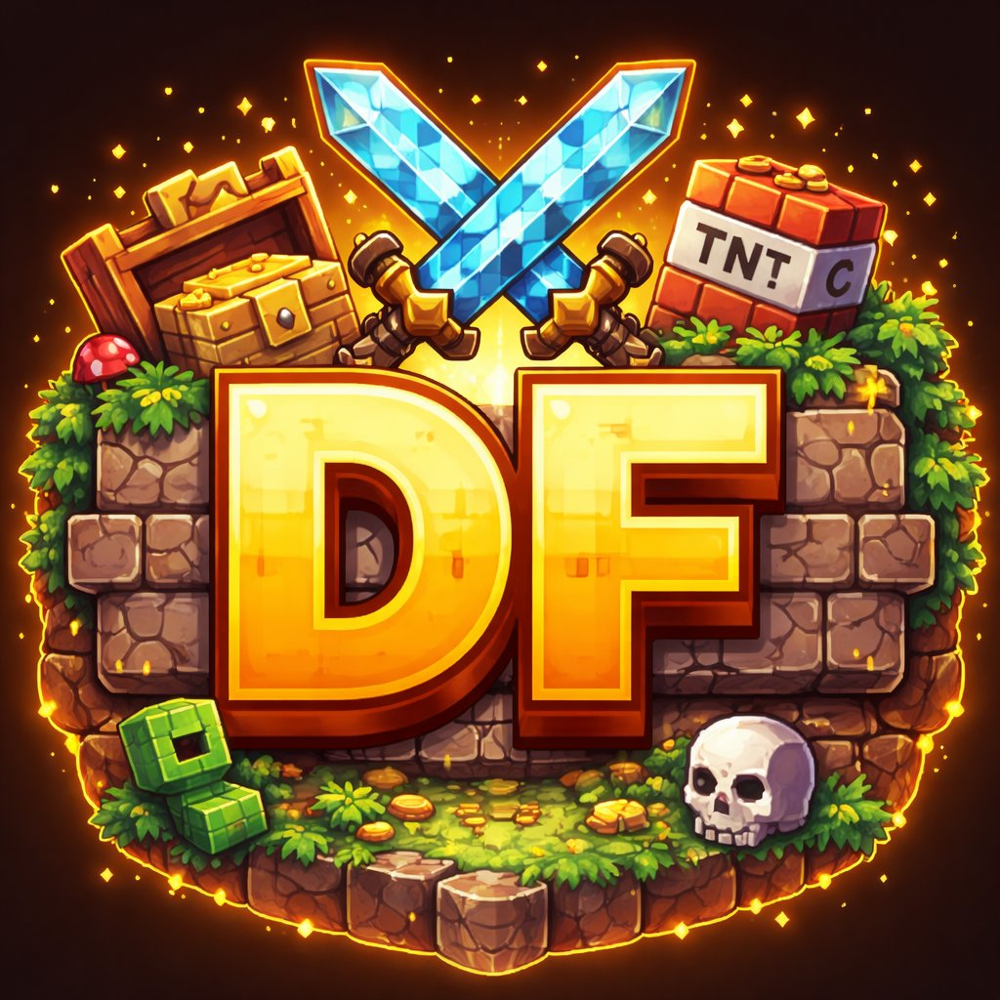

<div align="center">

  

  <h1>🎲 DiceForge</h1>
  <p><strong>Serveur Minecraft Java survie communautaire — 1.21.11</strong></p>

  <p>
    
    
    
    
    
    
  </p>

  <p>
    <a href="https://diceforgeproject.netlify.app">🌐 Site web</a> ·
    <a href="https://discord.gg/TPj3t3hmKc">💬 Discord</a> ·
    <a href="https://github.com/alexertz/diceforge/releases">📥 Télécharger le launcher</a> ·
    <a href="https://github.com/alexertz/diceforge/wiki">📖 Wiki</a>
  </p>

</div>

---

## 📦 Contenu du repo

| Dossier | Description | Stack |
|---|---|---|
| `launcher/` | Launcher desktop Mac & Windows | Electron, Node.js |
| `bot/` | Bot Discord avec intégration RCON | discord.js, RCON |
| `docs/` | Documentation et wiki | — |

---

## 🚀 Launcher

Launcher desktop qui installe automatiquement Minecraft 1.21.11 et connecte les joueurs directement au serveur DiceForge.

**Fonctionnalités :**
- ⬇️ Téléchargement automatique de Minecraft 1.21.11
- 🎮 Connexion directe au serveur au lancement
- 📡 Statut serveur en temps réel
- 🧠 Gestion de la RAM allouée
- 💾 Sauvegarde automatique du pseudo
- 🗂️ Gestion des fichiers du jeu
- 🖥️ Compatible Mac (Intel & Apple Silicon) et Windows

**Installation :**
```bash
cd launcher
npm install
npm start
```

**Build :**
```bash
npm run build-mac    # macOS .dmg
npm run build-win    # Windows .exe
```

**Prérequis :** Node.js 18+, Java 17+

---

## 🤖 Bot Discord

Bot Discord v2 avec slash commands, autocomplétion et intégration RCON complète.

**Fonctionnalités :**
- ⚙️ Commandes Minecraft via RCON avec autocomplétion (`/cmd`)
- 📊 Statut serveur en temps réel (`/status`, `/players`)
- 🛡️ Modération automatique (anti-liens, anti-insultes)
- 👋 Messages de bienvenue et au revoir
- 🎭 Système de rôles automatique
- 🎫 Tickets de support
- 🎵 Radio musicale dans les salons vocaux
- ▶️ Démarrage/arrêt du serveur à distance
- 📋 Surveillance des logs Minecraft en temps réel

**Installation :**
```bash
cd bot
cp .env.example .env
# Remplis les valeurs dans .env
npm install
node diceforge-bot.js
```

---

## ⚙️ Configuration

Voir le **[Guide de configuration complet](docs/CONFIGURATION.md)** — chaque valeur est expliquée étape par étape.

---

## 🤝 Contribuer

**On cherche des développeurs pour :**
- 🔧 Améliorer le launcher (mods, mises à jour auto, Linux)
- 🤖 Ajouter des fonctionnalités au bot Discord
- 🌐 Améliorer le site web

Consulte [CONTRIBUTING.md](CONTRIBUTING.md) pour savoir comment participer.

Tu peux aussi ouvrir une **Issue** avec le label `good first issue` si tu cherches par où commencer.

---

## 📡 Serveur

| Paramètre | Valeur |
|---|---|
| Adresse | `they-marketing.gl.joinmc.link` |
| Version | Java 1.21.11 |
| Moteur | PaperMC |
| Site | [diceforgeproject.netlify.app](https://diceforgeproject.netlify.app) |
| Discord | [discord.gg/TPj3t3hmKc](https://discord.gg/TPj3t3hmKc) |

---

## 📄 Licence

Projet sous licence **MIT** — libre d'utilisation et de modification. Voir [LICENSE](LICENSE).
